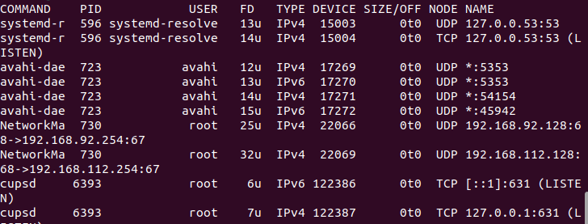
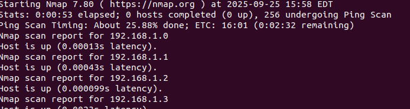
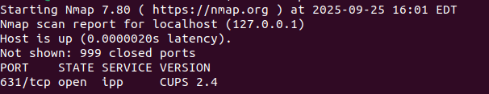
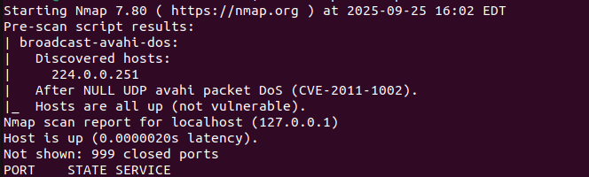
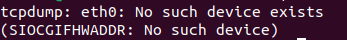
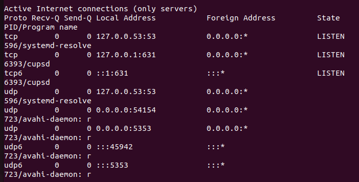
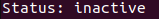

Firstly I used the "ip a command" to visualize and see all network interfaces and ip addresses connected to this Virtual machine(VM).

Secondly  the command netstat -tuln will be ran to verfiy which ports are currently open and what state these ports are in.

I should also verify what network connections are currently established to my server using "lsof -i -P -n"

Network Scan sudo nmap -sS -O localhost

 Check for Open Ports on the Server's Network sudo nmap -sP 192.168.1.0/24
 

 Check for Services and Versions sudo nmap -sV localhost

 

 Identify Potential Vulnerabilities sudo nmap --script vuln localhost
 

 Inspect Network Traffic sudo tcpdump -i eth0

 Monitor Network Connections in Real-Time sudo watch -n 1 netstat -tulnp

 

 Check Firewall Rules  sudo ufw status verbose

 
