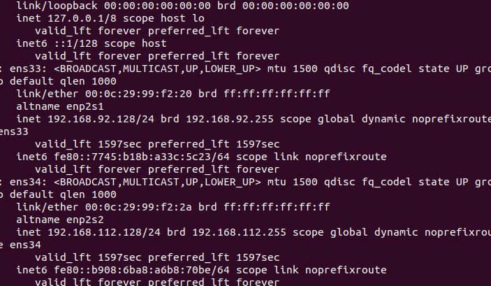
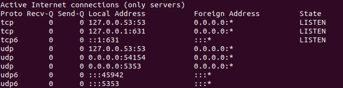
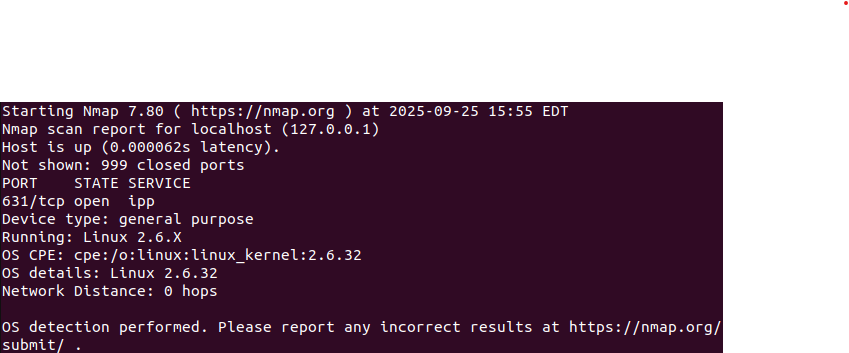

Firstly I used the "ip a command" to visualize and see all network interfaces and ip addresses connected to this Virtual machine(VM).

Secondly  the command netstat -tuln will be ran to verfiy which ports are currently open and what state these ports are in.

I should also verify what network connections are currently established to my server using "lsof -i -P -n"

Network Scan sudo nmap -sS -O localhost command helps identify any open ports,active services that are unknowlingly exposed

 Check for Open Ports on the Server's Network sudo nmap -sP 192.168.1.0/24 identifies all live hosts on the local network helping understand which devices are present.
 

 Check for Services and Versions sudo nmap -sV localhost This also scans for open ports but tries to determinew what service is active.

 

 Identify Potential Vulnerabilities sudo nmap --script vuln localhost Uses nmap vulnerability scanning scripts to identify exposed vulnerabilities on the server.
 

 Inspect Network Traffic sudo tcpdump -i eth0 this command is a packet anaylyzer that captures packet headers and displays network traffic

 Monitor Network Connections in Real-Time sudo watch -n 1 netstat -tulnp this command shows in real time current network connections through netstat for constant updates.

 

 Check Firewall Rules  sudo ufw status verbose Status of the fire wall one way to setup a uncomplicated firewall if need be.

 
