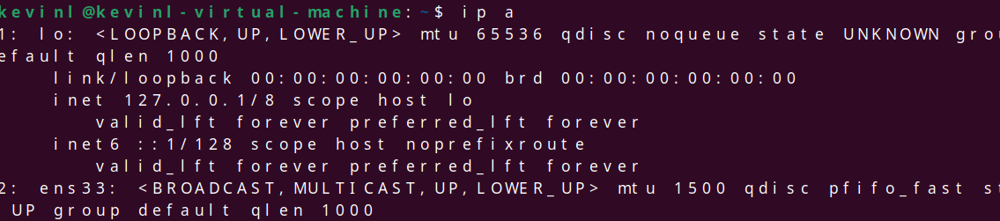
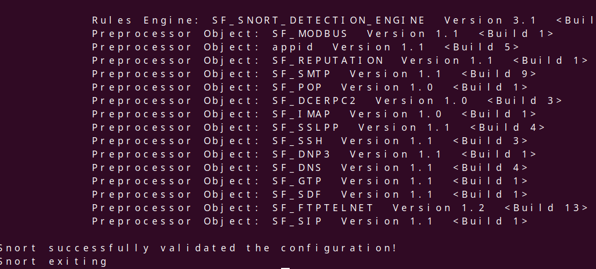
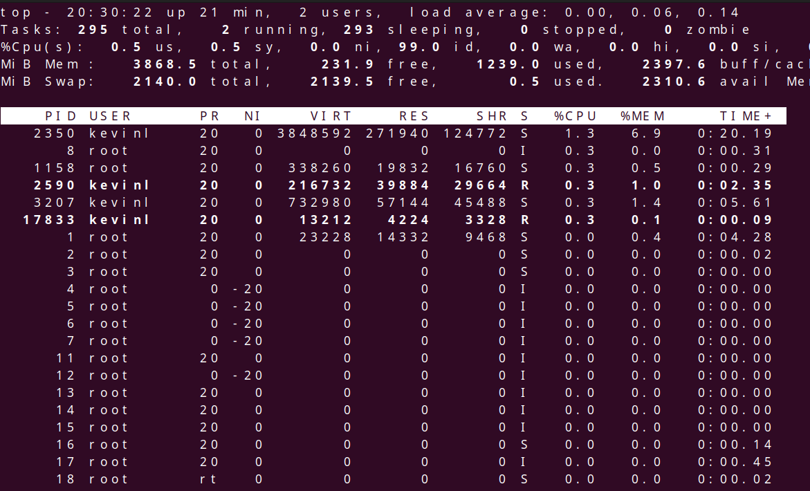

Using  snort I install via using "sudo apt install snort -y". Once it's installed I check my network interfaces using "ip a"

Next I validated that snort was configured properly using "sudo snort -T -c /etc/snort/snort.config. And Seeing it vaildate it's configuration.

Lastly Using sudo -D -c /etc/snort/snort.config -i eth0. It will create a deamon that will run snort in the background and we can view snort working via using the command top

