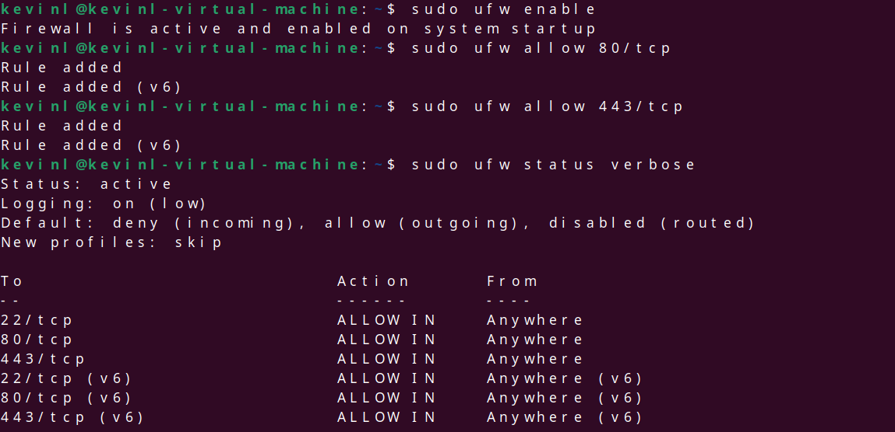

I checked the status of my UFW status before configuring anything checking its status with ufw status. Next I made sure once I activate the firewall it allows port 22 so I can still SSH into my system or else it would lock me out using sudo ufw allow 22/tcp. following I wanted to check what other ports are open using sudo ss-tuln.

Next I enabled the firewall then treated the server as a webserver and pondered which ports I would need open in this case which at minimum would be port 80 for http and 443 for https and ensured this ports were allowed to be spoken to.

I wanted to expermient with blocking a set IP and as well allowing a set IP to access a set port in this case blocking 10.0.0.0 from accessing any port and allowing 192.168.1.50 acess to simple mail transfer on port 587

AFterwords I enabled the ufw logs in order to view logs the firewall generates through its check for my system I decided to set its logging to high as it can have a range from low to full and high be right below full. I am able to look at this file in real time via -f in my sudo tail command.

Next I wanted to isolate  APPROVED connections and DENIED connections in these logs the Denied command has nothing generate has the one blocked IP didn't attempt to connect wheras the approved shows my conniction to my homelab.
