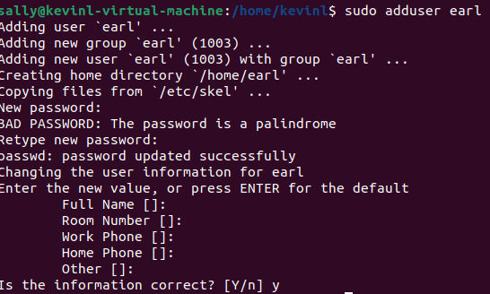

using sudo su root to change my shell into a root shell and the prompt asked me to enter the hosts password before changing the shell

Next would be viewing the difference between useradd and adduser
useradd just creates the user and does nothing else. while adduser creates a group the user and sets them up to the home directory.

Next I will change my user to sally using sudo su sally and it should change from kevin to sally.

I attempted to create a user with sally to ensure she didn't have any sudo privallegs and it turned to be true she didn't have the perm to certe a user.

I exited the root as it not wise to practice doing things in root as it can lead to someone easliy changing files or breaking things if I leave the root shell open when I'm not near
I'm just going to view the ID of my user using id

Ubuntu by default belongs to several groups

I updated sally's permission so they could also execute sudo commands using sudo usermod -aG sudo sally

I created a new user enusring sally permissons upgraded

Next I created a group named cybersec using "sudo groupadd cybersec" then added sally to the group using getent group cybersec

I created a new directory using mkdir and created a section where I can hold code I will refer to as labs
I checked the permissons of this directotry using ls -la lab1 and it showcases my user as both the owner and group owner both eligible to read write and execute 

I made a executable file using nano text editor just to print hello world using echo

as well as in c

Next I messed with file permissions primarily with the group using chmod g=rwx and rw for helloWorld

Using getfacl I just view the ACL of the file

Next I will give someone else permisson to access to a user to write to my file without being in the group or owner

Sally was succesfully given permison to alter my file
using the setfacl command "setfacl -m u:sally:rw- helloWorld" I didn't need to use sudo for any files in lab1 since it is owned by me and not root.
